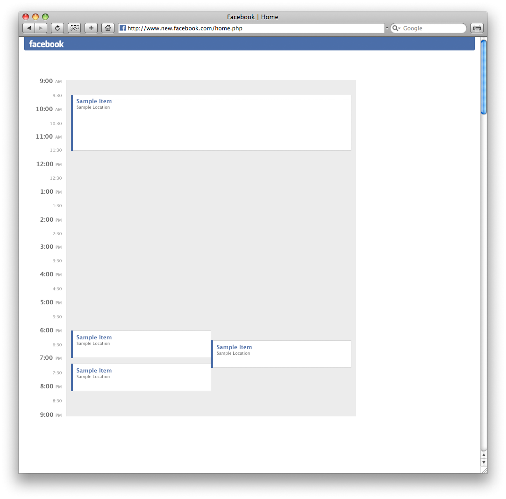

# Facebook Front end Coding Challenge Instructions

Thanks for your interest in the front end engineering role! The next step in the interview process will require you to complete our coding challenge. Our team reviews all submissions closely and it's been very helpful for us to gain insight into your problem solving and coding abilities. Included below are the details for the challenge, along with one attachment. Your solution will be run through a suite of test cases and evaluated on correctness, elegance, and readability.

# Puzzle Materials

Given a set of events, each with a start time and end time, render the events on a single day calendar (similar to Outlook, Calendar.app, and Google Calendar). There are several properties of the layout:

1. No events may visually overlap.
2. If two events collide in time, they MUST have the same width. This is an invariant. Call this width W.
3. W should be the maximum value possible without breaking the previous invariant.

Each event is represented by a JavaScript object with a start and end attribute. The value of these attributes is the number of minutes since 9am. So {start:30, end:90) represents an event from 9:30am to 10:30am. The events should be rendered in a container that is 620px wide (600px + 10px padding on the left/right) and 720px long (the day will end at 9pm). The styling of the events should match the attached screenshot.

You may structure your code however you like, but you must implement the following function in the global namespace. The function takes in an array of events and will lay out the events according to the above description.

`function layOutDay(events) { }`

This function will be invoked from the console for testing purposes. If it cannot be invoked, the submission will be rejected. This function should be idempotent.

In your submission, please implement the calendar with the following input:

`[ {start: 30, end: 150}, {start: 540, end: 600}, {start: 560, end: 620}, {start: 610, end: 670} ];`

A screenshot of the expected output is attached.

# FAQ

- Are frameworks such as JQuery, MooTools, etc. allowed? Yes, but please include the file with your source code.
- Is there a maximum bound on the number of events? You can assume a maximum of 100 events for rendering reasons, but your solution should be generalized.
- Do I have to guard against invalid input? You may assume valid input.
- What browsers need to be supported? Your solution should work in all modern standards- compliant browsers.
- Does my solution need to match the image pixel for pixel? No, we will not be testing for pixel matching.
- How will you be testing my solution? We will be running tests from the browser console by invoking the layOutDay() function. Your solution should not require a local web server (e.g. run from localhost) or have any other dependencies besides your html/css/js.

